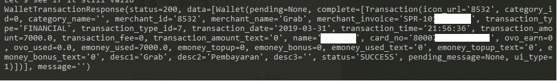

# ovopy
[](https://github.com/anysz/ovopy)
[](https://www.python.org/download/releases/3.6/)
[](https://github.com/anysz/ovopy/blob/master/LICENSE)
[](https://www.codacy.com/app/anysz/ovopy?utm_source=github.com&amp;utm_medium=referral&amp;utm_content=anysz/ovopy&amp;utm_campaign=Badge_Grade)
[](https://www.patreon.com/anysz)

*Un-official OVOid Python3 Client*

---
## Install
`python3 setup.py install`

## Function status
| Function                	| Status               	|
|-------------------------	|----------------------	|
| `login2FA`              	| OK                   	|
| `verifyLogin2FA`        	| OK                   	|
| `loginSecurityCode`     	| OK                   	|
| `getBudget`             	| OK                   	|
| `getFrontModel`         	| OK                   	|
| `generateTrxId`         	| OK                   	|
| `transferOvoBalance`    	| Error: Invalid Model 	|
| `logout`                	| OK                   	|
| `getUnreadNotification` 	| OK                   	|
| `getWalletTransaction`  	| OK                   	|

Tested on OVO v2.8.0 | 27/03/2019 | Python 3.6

## Examples



### Login
You can check at `test.py`.  

WARNING: When you logged in at the first time, make sure you got the token, because OVO limits loggedin device 
```python
import ovopy
# By default, settings saved to local .json file, so when you attempted to login with phone number (again) it'll use token that saved on local .json file resolved by phone number. You can disable this feature by adding `save_auth=False` at OVO class argument.
# ovo = ovopy.OVO(save_auth=False)

ovo = ovopy.OVO()
# with phone_number
l2fa  = ovo.login('<phone_number>')
vl2fa = ovo.verifyLogin2FA(l2fa.refId, '<SMS Pincode>', '<phone_number>')
lsc   = ovo.loginSecurityCode('<6digit of security code>', vl2fa.updateAccessToken)

# with token
lwt  = ovo.login(token='<token here JWT>')

# Test now! :D
print(ovo.getFrontModel())
```

### Account Information
Get account information
```python
r = ovo.getFrontModel()
print(r) # resp: FrontResponse(...)
```

### Budget Details
Get details of budget
```python
r = ovo.getBudget()
print(r) # resp: BudgetResponse(budget=History(amount=0, categoryId=None, spending=0), totalSpending=0, cycleDate=1, summary=[...])
```

### Transaction History
Get list of transactions history
```python
r = ovo.getWalletTransaction(page=1, limit=1)
print(r) # resp: WalletTransactionResponse(...)
```

### Balance Transfer
Currently, You can only transfer two times, for the 3rd one you'll need signature header. Please make pull request if you know how to reproduce the signature, Thank you.
```python
rtrx = ovo.transferOvoBalance('<to_phone_number>', 10000, None)
print(rtrx) # resp: CustomerTransferResponse(...)
```

### Notifications
```python
# Get all notifications
rx = ovo.getAllNotification()
print(rx) # resp: NotificationAllRespone(notifications=[...])

# Get total unread notification
r = ovo.getUnreadNotification()
print(r)  # resp: NotificationUnreadResponse(Total=0)
```

### Logout
Logout from client
```python
r = ovo.logout()
print(r) # resp: LogoutResponse(httpStatus=200)
```

## Errors
### OVOUnexpectedError
An error occured from REST Endpoint caused by http code response is not 200, Most of them caused by invalid client payload


## Other Programming Languages
Checkout also other Un-official OVO[id] Clients!

| Repository                                                   	| Language 	|
|--------------------------------------------------------------	|----------	|
| [@lintangtimur/ovoid](https://github.com/lintangtimur/ovoid) 	| PHP      	|
| [@anysz/ovopy](https://github.com/anysz/ovopy)               	| Python   	|

## Author
Anysz / [@Anysz](https://github.com/anysz)